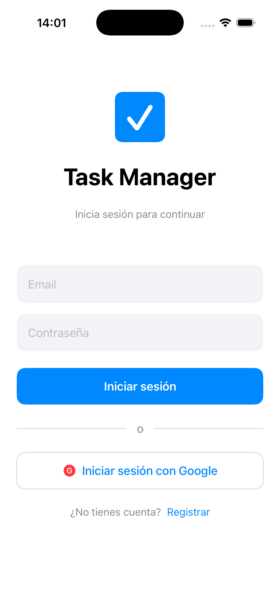
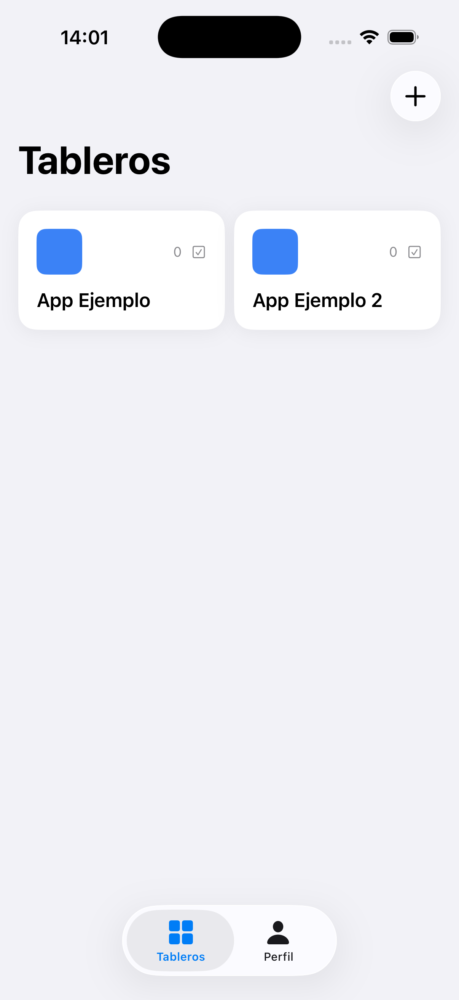
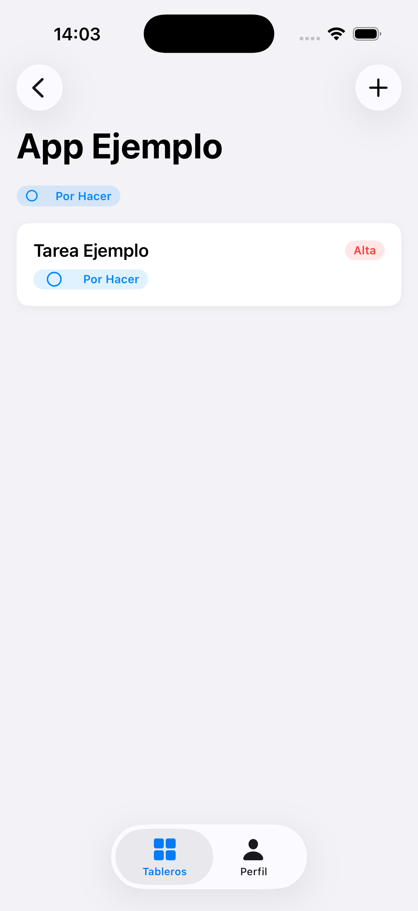
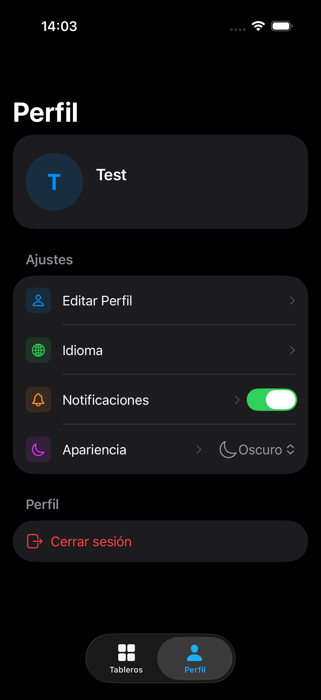
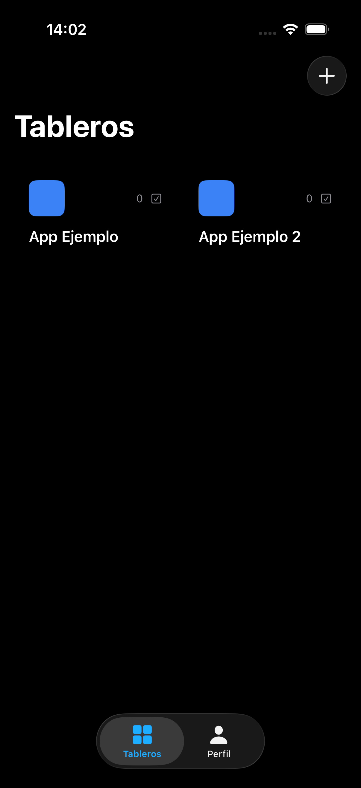
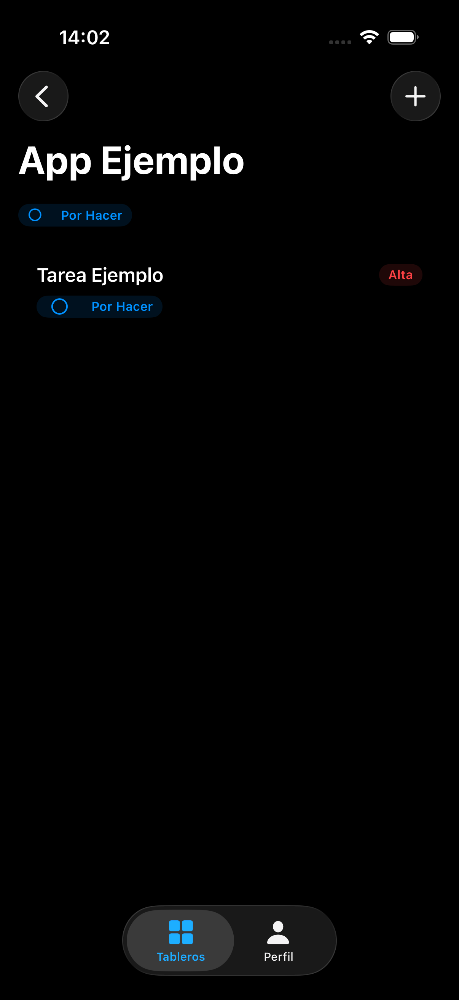

# Task Manager

A board-based task management app built as part of the [CastroDev](https://castrodev.com) portfolio. Organise your work into custom boards, track tasks by priority and status, and stay on top of everything — with full dark mode support.

---

## 📱 Screenshots

<p align="center">
  
  
  
  
</p>
<p align="center">
  
  
</p>

---

## ✨ Features

- 📋 **Boards** — Create boards with custom colours and see task counts at a glance
- ✅ **Tasks** — Add tasks with priorities (High, Medium, Low) and statuses (To Do, In Progress, Done)
- 🌙 **Dark mode** — Automatic dark/light mode based on system settings
- 👤 **Profile** — Edit name, manage notifications, switch language and appearance
- 🌍 **Multilingual** — English and Spanish support

---

## 🛠️ Tech Stack

| Layer | Technology |
|---|---|
| Language | Swift 6 |
| UI Framework | SwiftUI |
| State Management | `@Observable` + `@State` |
| Authentication | Firebase Auth (Email + Google) |
| Backend | .NET 10 REST API (Clean Architecture) |
| Database | Cloud Firestore |
| Infrastructure | Google Cloud Run |
| Dependency Management | Swift Package Manager |

---

## 🏗️ Architecture

The app follows **Clean Architecture** principles with strict layer separation:

```
TaskManager/
├── Core/
│   ├── Config/          # API and app configuration
│   ├── Errors/          # Failure types
│   └── Network/         # API client with Firebase auth
└── Features/
    ├── Auth/            # Login, register, Google Sign-In
    ├── Boards/          # CRUD boards
    ├── Tasks/           # CRUD tasks, priorities, statuses
    └── Profile/         # Settings, notifications, language
```

Each feature follows the pattern:

```
Feature/
├── Data/
│   ├── DataSources/     # Remote API calls
│   ├── Models/          # DTO models
│   └── Repositories/    # Repository implementations
├── Domain/
│   ├── Entities/        # Domain entities
│   ├── Repositories/    # Abstract repository interfaces
│   └── UseCases/        # Business logic use cases
└── Presentation/
    ├── Views/           # SwiftUI screens
    ├── ViewModels/      # @Observable ViewModels
    └── Components/      # Reusable UI components
```

---

## 🚀 Getting Started

### Prerequisites

- Xcode 16+
- iOS 17+ (simulator or device)
- Firebase project configured
- API running at `api.castrodev.com` or locally

### Installation

```bash
# Clone the repository
git clone https://github.com/castrodev/task-manager-ios.git

# Open in Xcode
open TaskManager.xcodeproj
```

Then:

1. Add your `GoogleService-Info.plist` to the main target in Xcode
2. Create a `Config.xcconfig` file in the project root:

```
API_BASE_URL = https://api.castrodev.com
```

3. Swift Package Manager dependencies resolve automatically on first open
4. Build and run with `⌘R`

### Running Tests

```bash
xcodebuild test \
  -scheme TaskManager \
  -destination 'platform=iOS Simulator,name=iPhone 16'
```

---

## 🔗 Related

- [CastroDev API](https://github.com/castrodev/castrodev-api) — Shared .NET 10 backend
- [Finance Tracker](https://github.com/castrodev/finance-tracker) — Personal finance app (Flutter)
- [Habit Tracker](https://github.com/castrodev/habit-tracker) — Daily habit tracking app (Flutter)
- [castrodev.com](https://castrodev.com) — Portfolio

---

---

# Task Manager

App de gestión de tareas por tableros. Organiza tu trabajo en tableros personalizados, controla tus tareas por prioridad y estado, y mantén todo bajo control — con soporte completo de modo oscuro.

---

## ✨ Funcionalidades

- 📋 **Tableros** — Crea tableros con colores personalizados y consulta el número de tareas de un vistazo
- ✅ **Tareas** — Añade tareas con prioridades (Alta, Media, Baja) y estados (Por Hacer, En Progreso, Completado)
- 🌙 **Modo oscuro** — Modo oscuro/claro automático según el sistema
- 👤 **Perfil** — Edita tu nombre, gestiona notificaciones, cambia el idioma y la apariencia
- 🌍 **Multiidioma** — Soporte para español e inglés

---

## 🛠️ Stack Tecnológico

| Capa | Tecnología |
|---|---|
| Lenguaje | Swift 6 |
| UI Framework | SwiftUI |
| Estado | `@Observable` + `@State` |
| Autenticación | Firebase Auth (Email + Google) |
| Backend | API REST .NET 10 (Clean Architecture) |
| Base de datos | Cloud Firestore |
| Infraestructura | Google Cloud Run |
| Gestión de dependencias | Swift Package Manager |

---

## 🚀 Instalación

### Requisitos previos

- Xcode 16+
- iOS 17+ (simulador o dispositivo)
- Proyecto Firebase configurado
- API disponible en `api.castrodev.com` o en local

### Pasos

```bash
# Clonar el repositorio
git clone https://github.com/castrodev/task-manager-ios.git

# Abrir en Xcode
open TaskManager.xcodeproj
```

A continuación:

1. Añade tu `GoogleService-Info.plist` al target principal en Xcode
2. Crea un fichero `Config.xcconfig` en la raíz del proyecto:

```
API_BASE_URL = https://api.castrodev.com
```

3. Las dependencias de Swift Package Manager se resuelven automáticamente al abrir el proyecto
4. Compila y ejecuta con `⌘R`

### Tests

```bash
xcodebuild test \
  -scheme TaskManager \
  -destination 'platform=iOS Simulator,name=iPhone 16'
```
